# South African Media Bias

This project calculates the over or under representation in the media of the three biggest political parties: [ANC](https://en.wikipedia.org/wiki/African_National_Congress), [DA](https://en.wikipedia.org/wiki/Democratic_Alliance_(South_Africa)), and [EFF](https://en.wikipedia.org/wiki/Economic_Freedom_Fighters).

It was prompted by a discussion between Helen Zille and Ferial Haffajee on [Tea with Helen](https://www.youtube.com/embed/3Fqoiz-Iyko?start=470&end=571), where Ms Haffajee claimed, in part, that the EFF is reported on proportionally to their vote share. I wanted to test that claim, and do a bit of _"political"_ data science.

The media outlets examined are the South African news outlets with the highest Alexa rank, which is a fair summary of the South African media. The outlets are [News24](https://www.alexa.com/siteinfo/news24.com), [IOL](https://www.alexa.com/siteinfo/iol.co.za), and the [Times](https://www.alexa.com/siteinfo/timeslive.co.za). Only their politics pages were examined. This research adheres to the ToS and robots.txt of the examined websites.

The politics pages of these outlets were scraped. The number of articles about each political party was recorded. A article was determined to be about a particular party based on the number of mentions of that party on the page.

The results as of 23rd of 12 2019 are:

##### News24

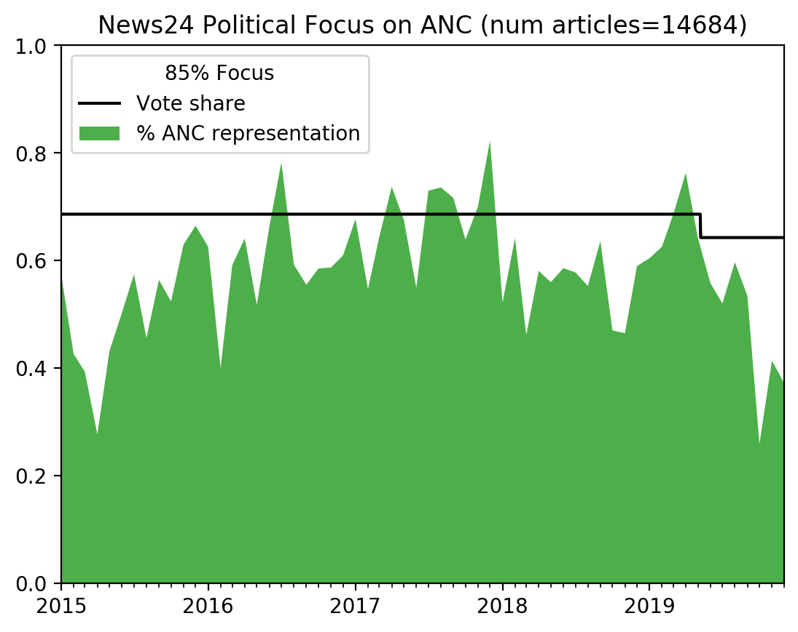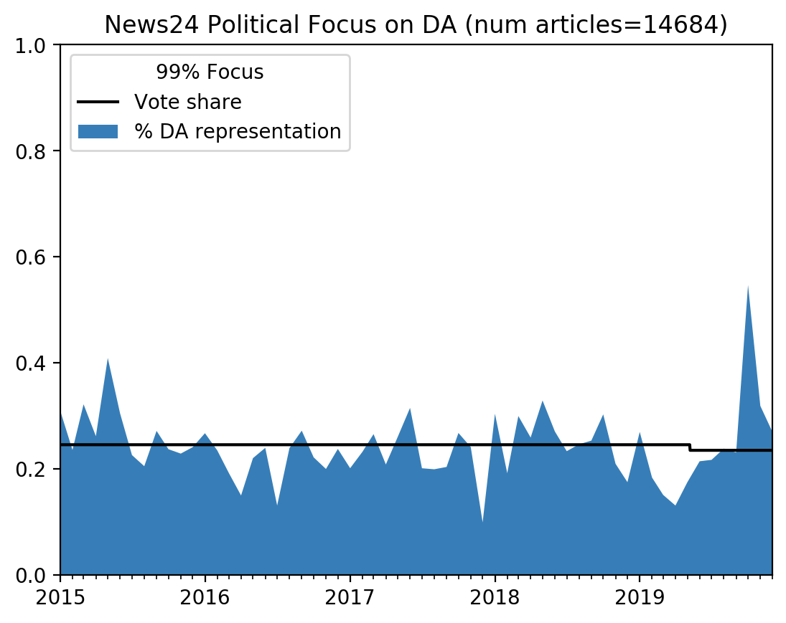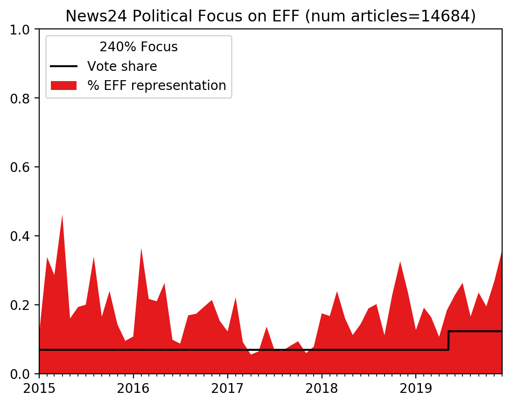

##### Times Live

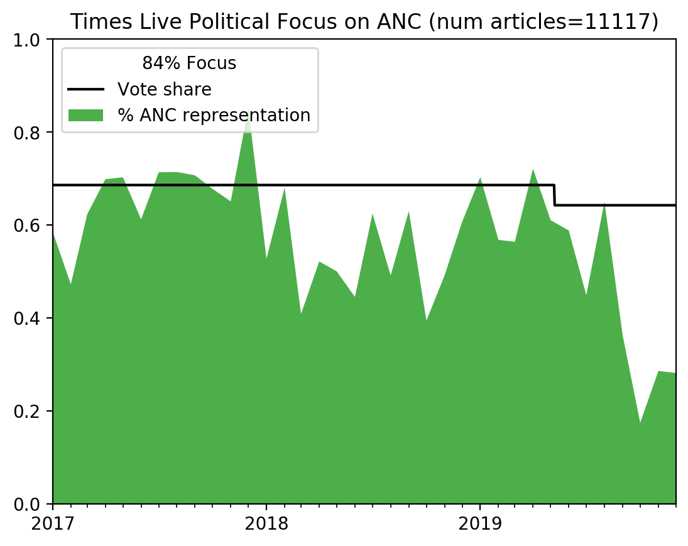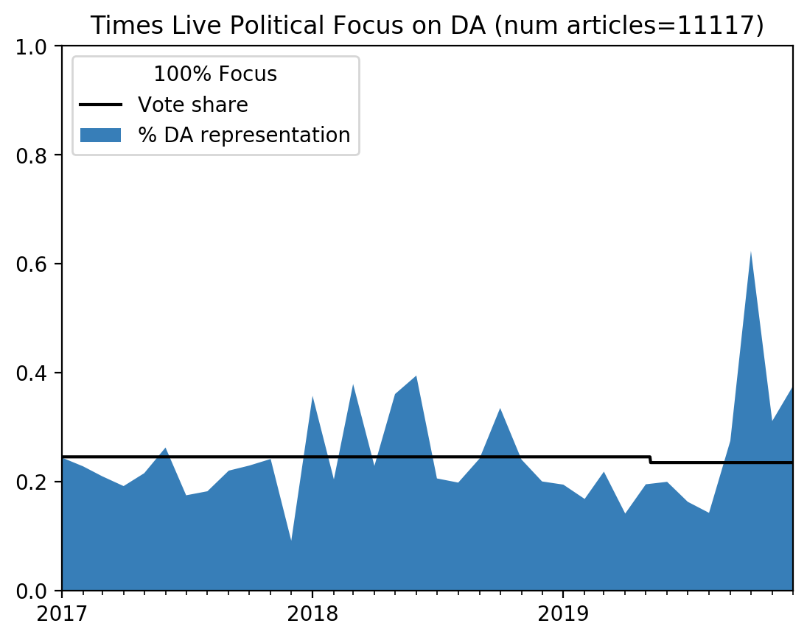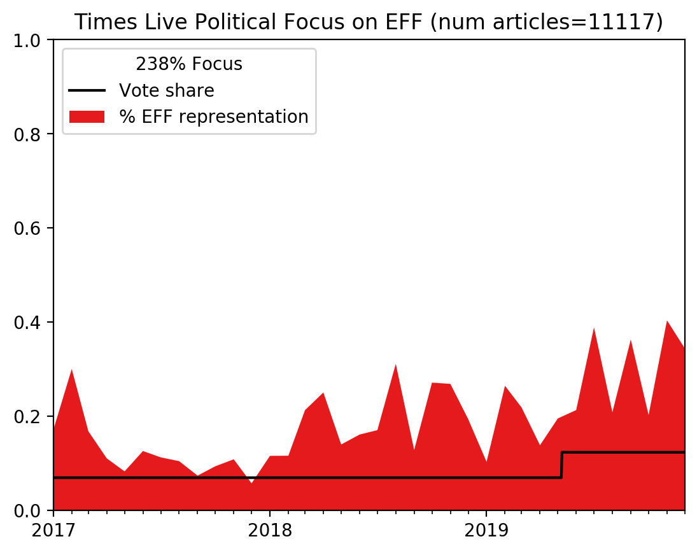

##### IOL

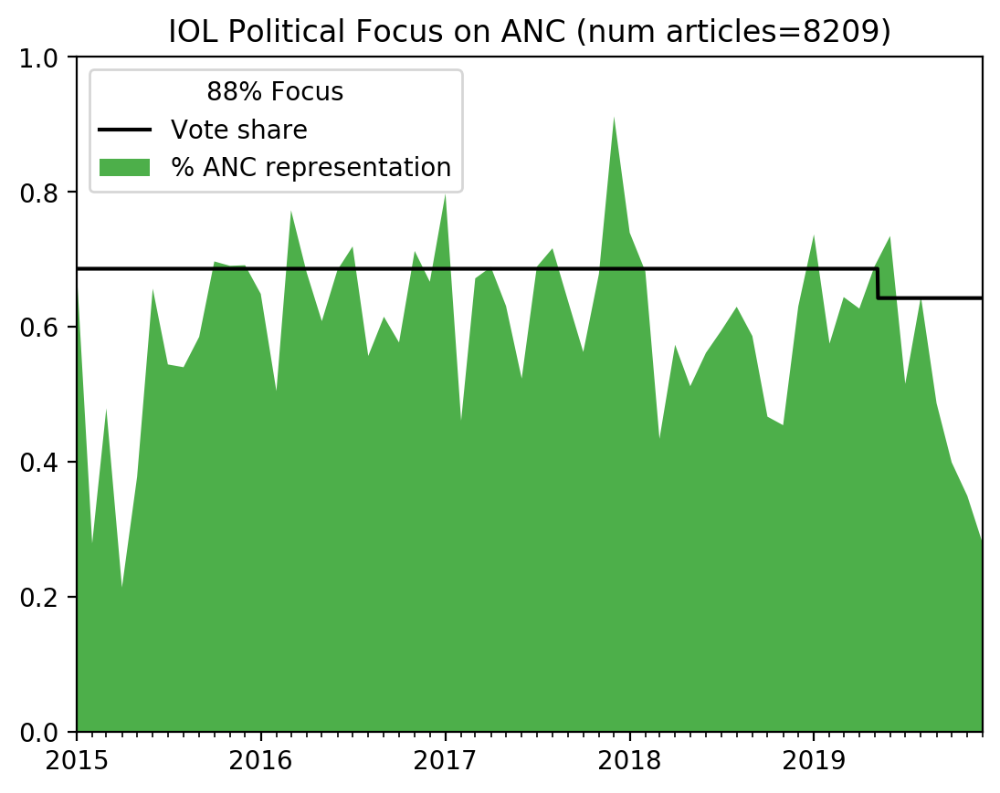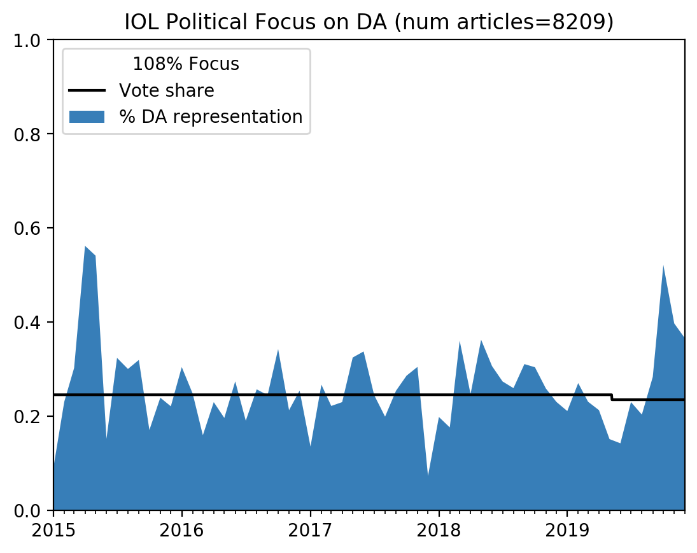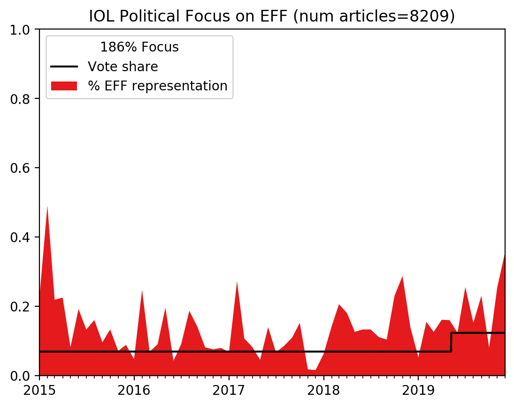

##### Pages scraped

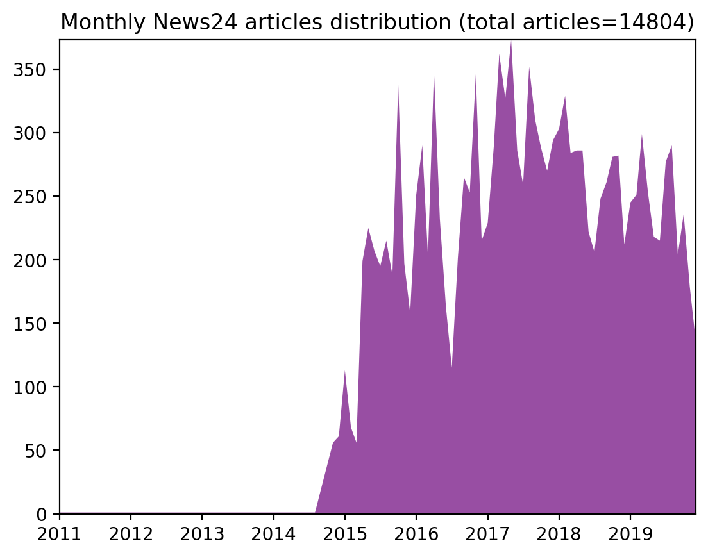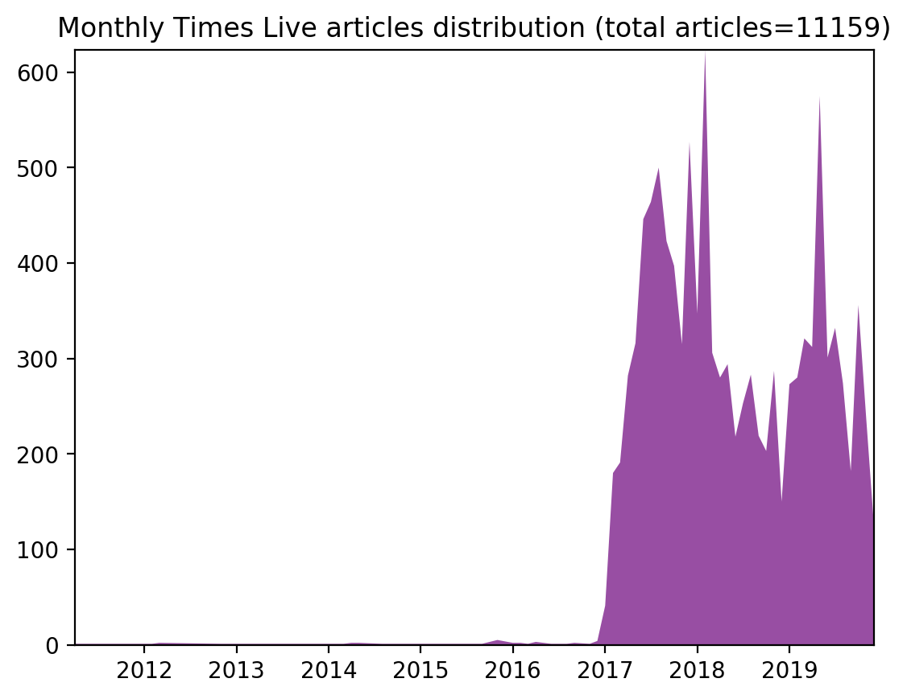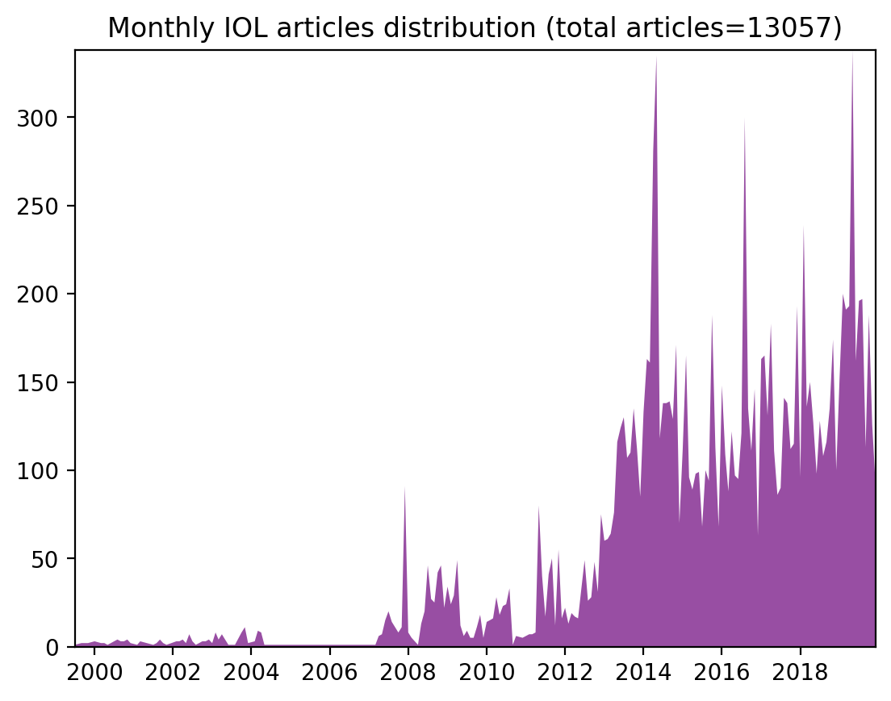

The raw data used to plot these figures can be found in the *.json files in the [results folder](./results).

These tools will not work indefinitely: if any of the websites change, the tools will no longer work.

## Prerequisites

All instructions assume you are using Debian/Ubuntu. If you are running Windows or Mac, adjust them accordingly.

    python3 -m venv venv
    venv/bin/pip install -r requirements.txt
    # sudo apt install linkchecker
    source venv/bin/activate

## Scraping

First run the initialisation tools to get a list of URLs from the politics pages of the respective websites.

    python scraper/initialisation_times_live.py

Then run the corresponding scraping tool:

    python scraper/scraper_times_live.py

Plot the results with:

    python visualisation/visualise.py
    
## Output files

Files are output into the `results/` directory, they are:

 * `*.urls`: These are the initial urls that the scraper will start the search on. Produced by the `scraper/initialisation_*` scripts.
 * `*.json`: These are the results files from scraping. Produced by the `scraper/scraper_*` scripts.
 * `*.stats`: These are the stats output from scrapy. They aren't really of interest to this project, but are fun to look at. Produced by the `scraper/scraper_*` scripts.

## Auxiliary tools

Some auxiliary tools are provided to help scraping.

`auxiliary/json_to_url.py` converts a .json results file into a .urls file to prime the scraper tool. Helpful if scraping failed midway, and you have a list of known good urls in the .json file.

`auxiliary/combine_urls.py` joins together two or more .urls files and removes the duplicates. Useful if you ran `auxiliary/json_to_url.py` and want to combine the output with the previous .urls file.

`auxiliary/json_remove_duplicates.py` removes duplicate entries from a json file. Sometimes the .json file will have multiple output blocks in it. No idea why this happens, might be a threading bug in scrapy.

`auxiliary/json_diff.py` compares two .json files and prints differences. Useful if you have two scrapes of the same site and want to compare them before merging.

`auxiliary/json_merge.py` merges two .json files and prints them to a new file. Useful if you have a new scrape to merge with an older one. This shouldn't really be necessary.
